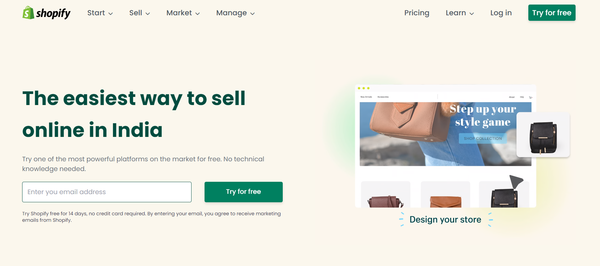

# Shopify Landing Page 

### Project Thumbnail

***
### Project details
This project is landing page of a company called Shopify. It is a purely responsive design. Only UI is developed for this project for this project, functionality is not. Developed solely for educational purpose.
Screen Sizes
- All screens

***
### Other Important Details
- >Time taken for completion : 16 hours
- Technologies Used
  - HTML
  - TailwindCSS
- VSCode for coding
- Personal Learnings in this project 
    - TailwindCSS
- Deployed on *Vercel*  **[ClickMe]()** 
*** 
#### About Author

- ~ Pritam Pal ~
- Profession - Full Stack Developer
- Contact Email - pal.pritam1416131@gmail.com
- [Personal Website](#)
- [LinkedIn](https://www.linkedin.com/in/pritampal1/)  

